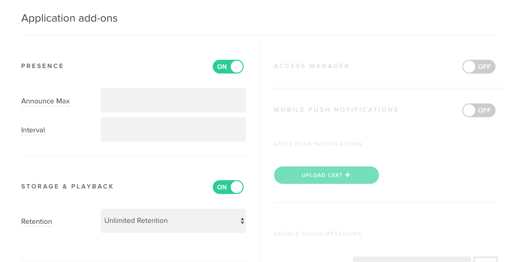
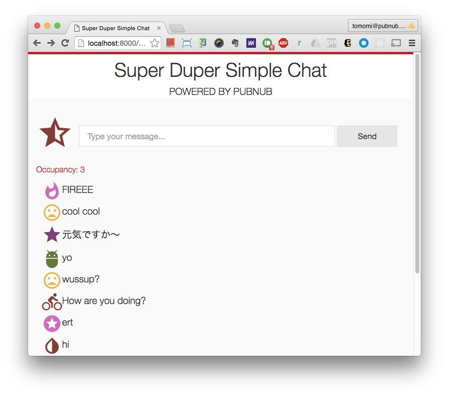

# 1. Building a Super Simple Chat App

In this workshop, you are going to use ES5 Vanilla JavaScript.

As your first web app, let's create a simple chat app- this app is an anonymous chat room and each user is assigned a random avatar.

Let's get started.

### Demo

Before you started coding, try running the index.html on a browser. You can run it locally by:

```bash
$ python -m SimpleHTTPServer 8001
```

then go to [http://localhost:8001/01-chatroom/](http://localhost:8001/01-chatroom/)


When you're ready to start coding, in your **index.html**, change the line 34 to:

```html
<script src="js/app.js"></script>
```

where **app.js** is the file you are going to code along with the workshop.


## Installation of PubNub

In your **index.html**, include [the latest JavaScript version](https://www.pubnub.com/docs/web-javascript/pubnub-javascript-sdk):

`<script src="//cdn.pubnub.com/pubnub-3.15.2.min.js"></script>`


## Initializing PubNub

In **app.js**, create an instance of the object and initializing using your API keys:

```javascript
var pubnub = PUBNUB.init({
  subscribe_key: 'sub-c-182105ac-...',
  publish_key: 'pub-c-ce04f67b-...'
});
```

If you are taking this course in a class room with a bunch of other students, let's use the keys provided in **app.js** already, so you can actually use your final app to chat with your classmates! Otherwise, use your own API keys.

and create a channel name. it can be almost any arbitary string. (there are some restrictions apply!)

```javescript
var channel = 'simple-chat';
```


## Creating a Random User

When the app is loaded, the user's avatar is assigned randomly.

The avatar is a combination of a font-icon and a color. We generate a string containing `face-`and `color-` with random numbers. So the generated string will be something like, `face-5 color-2`.


Here, we are actually using this randomized string as a class name in a DOM to insert a font icon in a cretain color, so we need to first set up [CSS](css/styles.css) and import Material Icons (font icon). Link it in your HTML file.

in **index.html**

```html
<link href="https://fonts.googleapis.com/icon?family=Material+Icons" rel="stylesheet">
```

in **style.css**,

```css
[class^="face"],
[class*=" face"] {
  font-family: 'Material Icons';
  speak: none;
  font-style: normal;
  font-weight: normal;
  font-variant: normal;
  text-transform: none;
  line-height: 1;
}
```

Here, we are using [CSS Attribute Selector](https://css-tricks.com/attribute-selectors/). It acts like RegEx.

The selector, `[class^="face"]` selects any element with a class that start from `face`, and `[class=*" face"]` selects the elements with a class name that contains `  face` (with a white space in the beginning).

Assign the randomized string as a class name to the avatar DOM. 

(Note: Using `<i>` tag for the glyph seems to non-semantic, but it actually is to represent this is an text, also an icon. `<i>` does *not* always mean "Italic". For semantic italic text, use `<em>`.)

```hrml
 <i class="avatar" class=""></i>
```

```javascript
var avatar = document.querySelector('.avatar');

var avatar.className = 'face-' + ((Math.random() * 13 + 1) >>> 0) + ' color-' + ((Math.random() * 10 + 1) >>> 0);
```


## Understanding Publish and Subscribe

Using `publish()` allows you to send messages to PubNub network as an object:

```javascript
pubnub.publish({
  channel: 'room-1', 
   message: {
    avatar: 'grumpy-cat.jpg', 
    text: 'Hello, hoomans!'
   },
   callback: function(m) { // success callback
     console.log(m);
   },
   error: function(e) {
     console.log(e);
   }
});
```

Subscribing is an async operation- upon the callback of `message` inside the `subscribe` operation, the client will receive all messages that have been published to the channel. The message `callback` is called every time a set of data is published:

```javascript
pubnub.subscribe({
  channel: 'room-1',
  message: function(m){ // success callback
    console.log(m.text);
  },
  error: function (e) {
    // Handle error here
    console.log(e);
  }
});
```

For example, when you are *subscribing* in your chat app, it means you 1) joining the chat room called *room-1*, and receiving messages as other subscribers to the channhel publish a message.


## Sending a Message to a Chat Room

In your html, create a text box and a **Send** button.

```html
<i class="avatar" class=""></i>
<input type="text" placeholder="Type your message..."> 
<button>Send</button>
```

Create an object to access the UI DOM:

```javascript
var input = document.querySelector('input');
var button = document.querySelector('button');
```


Create a function to send a message using PubNub's `publish()`:

```javascript
function send() {
  pubnub.publish({
    channel: channel,
    message: {
      avatar: avatar.className,
      text: input.value
    },
    callback: function(){input.value = '';}
  });
}
```


In your JS, add event listeners to create two types of user interactions:

1. When the user type and press Return, send the message (listen to `keyup` event)
2. When the user press **Send**, send the message (listen to `click` event)


```javascript
input.addEventListener('keyup', function(e) {
    (e.keyCode || e.charCode) === 13 && send()
  }, false);
```

```javascript
button.addEventListener('click', send, false);
```

Now, your app users can send a message either by pressing Return or by clicking the Send button!


## Receiving the Message

Now you are using `subscribe()` to receive messages that have been published to the channel, "simple-chat": 

```javascript
pubnub.subscribe({
  channel: channel,
  callback: function(m) {
    output.innerHTML = '<p><i class="' + m.avatar + '"></i><span>' + m.text.replace(/[<>]/ig, '') + '</span></p>' + output.innerHTML;
    }
  }
});
```

At the success callback, you are inserting a new DOM with the received message. Here, you should notice `m.text.replace()` to strip off any HTML tags. If you have time, modify this part to make some smarter text replacing scheme.

## Extras

PubNub provide more good features including [Presence](https://www.pubnub.com/docs/web-javascript/presence) and [Storage & Playback (History API)](https://www.pubnub.com/docs/web-javascript/storage-and-history).

You can use the **Presence** feature to see how many people are online (and who), and **History** gives you previously sent messages (prior to your login).

To enable the features, you need to configure in your [PubNub Admin Console](https://admin.pubnub.com/#/login).

First, click the **Keyset**, then, enable these features:



and press **Save**.


## Displaying How Many People Online

Modify your subscribe block, and add `presence` param:

```javascript
p.subscribe({
    channel: channel,
    callback: function(m) {
      output.innerHTML = '<p><i class="' + m.avatar + '"></i><span>' + m.text.replace(/[<>]/ig, '') + '</span></p>' + output.innerHTML;
    },
    // Adding presence
    presence: function(m) {
      presence.textContent = 'Occupancy: ' + m.occupancy;
    }
  });
```


## Displaying Previously Sent Message When the App is Loaded

Create a function to call PubNub `history()` method to fetch old data from storage:

```javascript
function fetchOldMessages() {
  pubnub.history({
    channel: channel,
    count: 50,
    callback: function(messages) {
      messages[0].forEach(function(m) {
        output.innerHTML += '<p><i class="' + m.avatar + '"></i><span>' + m.text.replace(/[<>]/ig, '') + '</span></p>' + output.innerHTML;
        });
      }
    });
}
```

The `count` is where you define how many message you want to retrieve. The default is 100.

Then, call the function when you subscribe, but use `connect` param. This means when PubNub socket connection is established, call the method for the first time only.

```javascript
pubnub.subscribe({
    channel: channel,
    callback: function(m) {
      output.innerHTML = '<p><i class="' + m.avatar + '"></i><span>' + m.text.replace(/[<>]/ig, '') + '</span></p>' + output.innerHTML;
    },
    presence: function(m) {
      presence.textContent = 'Occupancy: ' + m.occupancy;
    },
    // Adding connect to fetch old messages
    connect: fetchOldMessages
  });
```


Ta-da!!!




