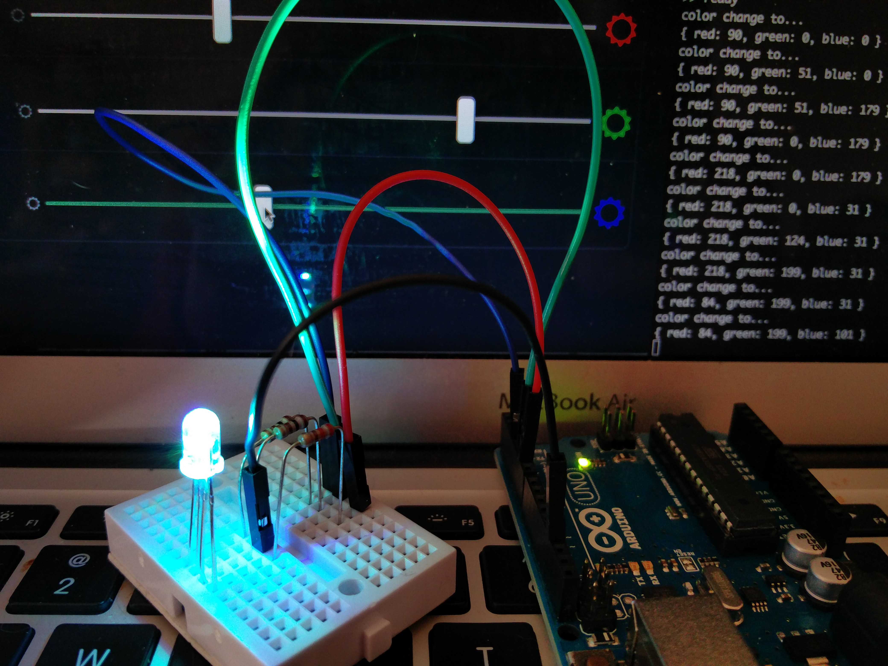

#  2. Internet of Things: HUE Clone

PubNub is not just for chat apps, but has so many other use cases- one of the popular use cases is for IoT (Internet of Things) applications.(More on that <a href = "http://www.forbes.com/sites/jacobmorgan/2014/05/13/simple-explanation-internet-things-that-anyone-can-understand/#5eaaef2b6828">here.</a> Companies like Insteon and LIFX are using the PubNub network for their smart home devices including smart light bulbs. 

Here, you are going to create a remote control to change the color of an LED, a dumbed-down version of Philips HUE.

The simplest operation can be describe as below:


### Demo

Try it at: [http://localhost:8001/02-iot/](http://localhost:8001/02-iot/)

You are using the web UI to control an instructor's Arduino to change the LED color. Notice when somebody else changed the values, your web UI reflects the changes.


## Creating Web User Interface

In your **index.html**, include [the latest JavaScript version](https://www.pubnub.com/docs/web-javascript/pubnub-javascript-sdk):

```html
<script src="//cdn.pubnub.com/pubnub-3.x.x.min.js"></script>
```


As a control slider, use the HTML5 element `<input type="range">` to draw a slider bar to let a user to change the value of each “R”, “G”, and “B”. Each color has the values of 0 to 255 (min="0" max="255") and uses only integer values by setting the increment by 1 (step="1").

```html
<input id="red" type="range" min="0" max="255" step="1" value="0">
```

This controls the intensity of the red color. I won’t talk about styling with CSS in this tutorial, but you can always view the **index.html** and **style.css** to see how they are styled, and modify as you want.


## Initializing PubNub

In **app.js**, create an instance of the object and initializing using your API keys:

```javascript
var pubnub = PUBNUB.init({
  subscribe_key: 'sub-c-182105ac-...',
  publish_key: 'pub-c-ce04f67b-...'
});
```

If you are taking this course in a classroom with a bunch of other students, let's use the keys provided in **app.js** already, so you can actually use your final app to chat with your classmates! Otherwise, use your own API keys.

and create a channel name. it can be almost any arbitary string. (there are some restrictions apply!)

```javascript
var channel = 'hue-clone';
```


## Sending a Color Value to a LED

Create an object to access the slider:

```javascript
var red = document.getElementById('red');
var green = document.getElementById('green');
var blue = document.getElementById('blue');
```

Listen to the change event of the slider DOM, and send any changes to PubNub with the `publish` method.

```javascript
// Initial brightness state
var brightness = {r: 0, g: 0, b: 0}; 

red.addEventListener('change', function(e){
  brightness.r = this.value;
  publishUpdate(brightness);
}, false);
```

You also need to add a listener for green and blue sliders.

The `publishUpdate()` takes an object that include` r` (red), `g` (green), and `b` (blue) values to publish to PubNub network:

```javascript
function publishUpdate(data) {
  pubnub.publish({
    channel: channel, 
    message: data
  });
}
```

The very basic web UI to control the LED is done. You should be able to try your web app now. 

As your classmates play with their own app to control the same LED, you should notice that youe web UI is **not** reflecting the changes made by your classmates.

In the next step, modify the app so that the values on your UI is always true to the actual LED color.


## Subscribing Data Coming from All Other Subscribers

To fetch all upcoming data from everybody who has the access to control the LED.

```javascript
pubnub.subscribe({
  channel: channel,
  message: resetSliders
});
```

```javascript
function resetSliders(m) {
  red.value = brightness.r = m.r;
  green.value = brightness.g = m.g;
  blue.value = brightness.b = m.b;
}
```

At the subscribe success callback, reset the slider values to the last published value. Now you should see your slider knob changed the position by itself, when the LED color changes.


## Setting an Intial State of the LED

When you refresh the app, you notice the sliders get reset to zero, so you should fix that.

So what you need to do is reading the very last value sent to PubNub by using `history()` upon the socket connection:

```javascript
pubnub.subscribe({
  channel: channel,
  message: resetSliders, // reset the slider UI every time a subscriber makes a change
  connect: initSliders // initialize the slider states for the fisrt time launching the app
});
```

In the `initSliders` function, call the history but read only the last data, then reset the value using the `resetSliders` function again.

```javascript
function initSliders() {
  pubnub.history({
    channel: channel,
    count: 1,
    callback: function(m) {
      resetSliders(m[0][0]);
    }
  });
}
```

Now the slider UI should align with the last state of the LED.

Let's play with it together!


## Arduino with Node.js

I am not covering this in this workshop, but if you are interested, look at the code in [arduino-led](arduino-led).




You may wonder about the IoT security-

In reality, you need to write more code to build secure IoT systems. PubNub does offer AES & TLS/SSL data encryptions, and <a href = "https://www.pubnub.com/docs/web-javascript/pam-security">Access Manager</a> so you can control users and devices.

[See more info on PubNub.com](https://www.pubnub.com/products/security-overview/)!


