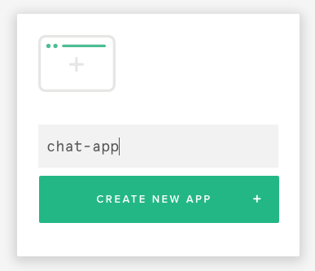

# Workshop: Building Realtime Apps with PubNub JavaScrpt SDK

This provides step-by-step tutorials of building realtime web applications using PubNub global data stream network.

[PubNub](https://pubnub.com) is a globally distributed data stream network that allows you to build real-time applications easily. Its core feature, pub/sub, sends and receives data between multiple users simultaneously.

You will be learning how to write simple applications using PubNub JavaScript SDK 3.x.

🍄 [Presentation Slides Link](https://docs.google.com/presentation/d/17bwoGWTYEz9Q0hhA1ezmzjQ_iFo4AEp9gm0bGyryuC0/edit#slide=id.p)

## Getting Started with PubNub

Sign up [PubNub](https://www.pubnub.com/get-started/) to get your own API keys.

Once you are signed up, you need to get your own keys to get started:

1. Go to [admin.pubnub.com](https://admin.pubnub.com)
2. Create a new app by entering an app name (e.g. chat-app), and press **Create a New App**
3. Once the app is created, click the app from the dashboard. Now you should see your publish and subscribe keys.




## Get Started by Cloning the Repo

Clone this repo with git to your local working environment to get started.

```bash
$ git clone https://github.com/pubnub/javascript-workshop.git
```

Or just download the zip file, and unzip in your working directory.

Your starting point, js/**app.js** has very minimal code that scaffold the app you're going to build, while **final-app.js** contains the entire code you can reference any time throughout the workshop.

Also, **index.html** and css/**style.css** have been completed for you, but feel free to modify the look-and-feel.

Now, let's get started!

## Projects

- 1 - 💬 [Building a Super Simple Chat Room](01-chatroom) 


- 1a - 😹 [Adding the 3rd party API - Enabling Giphy commands](01a-chatroom-giphy)


- 2 - 💡 [Internet of Things: Creating a HUE Clone](02-iot)


## Learn More

### Docs

We have many tutorials on PubNub.com and elsewhere!

- [PubNub JavaScript SDK](https://www.pubnub.com/docs/web-javascript/pubnub-javascript-sdk) - Getting started guide and tutorials
- [Getting Started Guide](https://www.pubnub.com/docs/getting-started-guides/pubnub-publish-subscribe) - Walk through every API 

### Videos

- [University of PubNub](https://www.pubnub.com/developers/university/) - Video lecture series
- More on [Vimeo](https://vimeo.com/pubnub)

### More Tutorials

- [Lots of tutorials here!!!](https://www.pubnub.com/blog/category/demos-tutorials-and-how-tos/)

#### AngularJS 

- [Getting Started](https://www.pubnub.com/developers/angularjs/)
- [PubNub AngularJS SDK](https://www.pubnub.com/docs/angularjs-javascript/pubnub-javascript-sdk)

#### React.js

- [Tutorials on PubNub Blog](https://www.pubnub.com/blog/author/rangle-io-staff/)
- [Building a Collaborative Web App With PubNub, React.js, and ES6](http://code.tutsplus.com/tutorials/building-a-collaborative-web-app-with-pubnub-reactjs-and-es6--cms-26565) on Tuts+ Code
